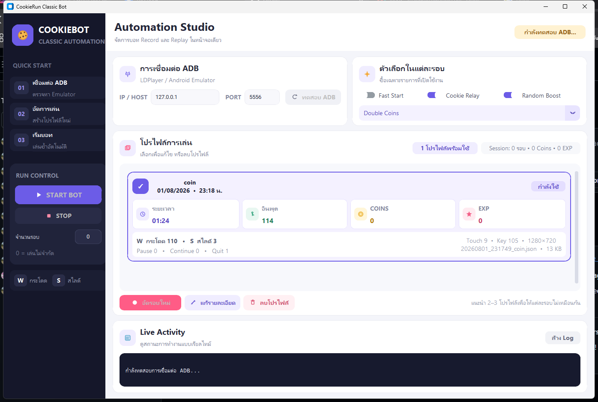

# CookieRun Classic Bot

บอทอัตโนมัติสำหรับ CookieRun Classic บน Windows ใช้ ADB จับภาพจาก Android/LDPlayer,
OpenCV ตรวจหน้าจอ และระบบ Record/Replay สำหรับบันทึกการกระโดดและสไลด์ พร้อม GUI ภาษาไทย
แบบ Profile Gallery

> เวอร์ชันปัจจุบัน: **1.3.0**
> โปรแกรมนี้เป็นโครงการทดลองสำหรับการเรียนรู้ระบบ Automation และ Computer Vision
> การใช้งานกับบัญชีจริงอาจขัดกับข้อกำหนดของเกม ผู้ใช้ต้องรับผิดชอบความเสี่ยงด้วยตนเอง



## จุดเด่น

- GUI สมัยใหม่ด้วย CustomTkinter ตัวหนังสือขนาดอ่านง่ายและมีไอคอน
- เชื่อมต่อ LDPlayer/Android ผ่าน ADB โดยไม่เปิดหน้าต่าง CMD รบกวนการเล่น
- Record การเล่นจากปุ่ม **W = กระโดด** และ **S = สไลด์**
- เก็บ Pause, Continue และ Quit กลางรอบไว้ในโปรไฟล์
- Replay ตามเวลาแบบ Absolute Timestamp พร้อมชดเชย ADB latency
- สุ่มใช้โปรไฟล์ที่อัดไว้ 2–3 แบบ หรือใช้โปรไฟล์เดียวซ้ำได้
- กำหนดจำนวนรอบได้ โดย `0` หมายถึงเล่นไม่จำกัด
- หากหลุดกลับ Main Menu ก่อนจบรอบ จะยกเลิกอินพุตที่ค้าง ไม่นับรอบนั้น และเริ่มใหม่
- ซื้อและใช้ Fast Start, Cookie Relay และ Desired Random Boost ได้อัตโนมัติ
- Cookie Relay จะซื้อเฉพาะตอนของเหลือ `0`
- Desired Random Boost ตรวจเครื่องหมายถูกก่อน Multi-Buy และไม่ใช้ Coins หากเลือกไม่สำเร็จ
- ตรวจและกดปุ่ม Confirm อัตโนมัติด้วยตัวเฝ้าแยก
- OCR อ่าน Coins และ XP จากหน้า Result หลังตัวเลขและตัวคูณหยุดนับ
- รับ Mystery Box, Level Up, Daily Reward, Relic และหน้ารางวัลหลังจบเกม
- ตรวจ Anti-Bot, Connection Lost และ Inactive พร้อมกู้สถานะอัตโนมัติ
- โปรไฟล์แสดงวันที่อัด เวลา อินพุต Coins/EXP จำนวนกระโดด/สไลด์ และรายละเอียดไฟล์ครบ

## ดาวน์โหลดสำหรับ Windows

ดาวน์โหลด `CookieRunClassicBot-Setup.exe` จากหน้า
[GitHub Releases](../../releases/latest) แล้วติดตั้งได้โดยไม่ต้องลง Python

ตัวติดตั้งรองรับภาษาไทย/อังกฤษ ติดตั้งแบบรายผู้ใช้ ไม่ต้องใช้สิทธิ์ Administrator และมีตัวถอนการติดตั้ง

## สิ่งที่ต้องมี

- Windows 10 หรือ Windows 11 แบบ 64-bit
- LDPlayer หรือ Android Emulator ที่เปิด ADB ได้
- ความละเอียดหน้าจอ Emulator **1280×720 เท่านั้น**
- Android Platform Tools (ADB)

โปรแกรมค้นหา `adb.exe` ตามลำดับนี้:

1. `platform-tools\adb.exe` ที่อยู่ข้างโปรแกรม
2. `D:\platform-tools-latest-windows\platform-tools\adb.exe`
3. ADB ที่อยู่ในตัวแปร `PATH`

## เริ่มใช้งานแบบรวดเร็ว

1. ตั้งความละเอียด LDPlayer เป็น `1280×720`
2. เปิด ADB debugging ของ LDPlayer
3. เปิด CookieRun Classic และค้างไว้ที่หน้าหลัก
4. เปิด CookieRun Classic Bot
5. กรอก IP/Host และ Port เช่น `127.0.0.1:5556`
6. กด **ทดสอบ ADB** ต้องเห็นข้อความเชื่อมต่อสำเร็จและความละเอียด `1280×720`
7. อัดโปรไฟล์อย่างน้อยหนึ่งรอบ
8. เลือกตัวช่วยที่ต้องการและกด **START BOT**

## การอัดโปรไฟล์

1. เลือก Fast Start, Cookie Relay หรือ Random Boost ที่ต้องการใช้ในรอบอัด
2. กด **อัดรอบใหม่** และตั้งชื่อโปรไฟล์
3. รอจน Log แจ้งว่าเริ่ม Record แล้ว
4. เล่นด้วยปุ่ม:
   - `W` = กระโดด
   - `S` = สไลด์
5. เล่นจนถึงหน้า Result หรือกด Pause → Quit หากต้องการโปรไฟล์แบบจบบางส่วน

โปรไฟล์จะบันทึกอัตโนมัติหลังทุกอินพุต จึงยังเก็บข้อมูลได้หากโปรแกรมหยุดก่อนจบรอบ

### ข้อมูลที่แสดงในการ์ดโปรไฟล์

- ชื่อและวันที่บันทึก
- ระยะเวลารวม
- จำนวนอินพุตทั้งหมด
- Coins และ EXP ที่ OCR อ่านได้
- จำนวนกระโดดและสไลด์
- จำนวน Pause, Continue และ Quit
- จำนวน Touch และ Keyboard event
- ความละเอียดหน้าจอ ชื่อไฟล์ และขนาดไฟล์

## การ Replay

- บอทเลือกหนึ่งโปรไฟล์แบบสุ่มก่อนเริ่มแต่ละรอบ
- ถ้ามีโปรไฟล์เดียว จะใช้โปรไฟล์นั้นทุกครั้ง
- ควรอัด 2–3 รอบเพื่อให้รูปแบบการเล่นต่างกัน
- Replay ใช้พิกัดเดิมจาก Record โดยไม่สุ่มขยับตำแหน่ง
- ระบบใช้ Absolute Timestamp เพื่อไม่ให้ความคลาดเคลื่อนสะสมทีละคำสั่ง
- ค่า ADB latency เริ่มต้นชดเชยไว้ `40 ms` ตามการวัดกับ LDPlayer

หากกลับถึง Main Menu ก่อนพบ `GAME_COMPLETE` บอทจะหยุดชุด Replay เก่า ลดจำนวน Attempt กลับ
และเริ่มขั้นตอน Start → ซื้อของ → Play ใหม่ทันที

## Coins และ EXP จากหน้า Result

OCR ทำงานภายในเครื่องด้วย RapidOCR/ONNX Runtime ไม่มีการส่งภาพไปเซิร์ฟเวอร์ภายนอก

ขั้นตอนการอ่านค่า:

1. ตรวจพบหน้า Result
2. หยุด Recorder/Replay ทันที
3. รออย่างน้อย 2.5 วินาทีให้ตัวคูณเริ่มคำนวณครบ
4. อ่าน Coins และ XP ซ้ำทุก 0.45 วินาที
5. ต้องได้ค่าเดิมติดต่อกัน 3 ครั้งจึงถือเป็นค่าสุดท้าย
6. บันทึกค่าลงโปรไฟล์แล้วจึงกด OK

ใน Log จะเห็นข้อความลักษณะนี้:

```text
[OCR] Reward count-up: coins=1198 exp=123
[OCR] Final rewards stable: coins=1198 exp=123
```

หาก OCR อ่านไม่ได้ ระบบจะเก็บค่าเดิมไว้และบันทึกภาพใน `debug_screens/` สำหรับปรับตำแหน่งภายหลัง

## Desired Random Boost

รองรับตัวเลือกต่อไปนี้:

1. Double Coins
2. +15% Score Bonus
3. -15% HP Drain
4. Revive Once with 80 HP
5. 70% Crush Chance
6. +17% Base Speed
7. Gold Coin Magic
8. -30% Collision Damage
9. +20% HP from Potions
10. Magnetic Aura
11. 2 Pit Lifts

หลังเปิด Multi-Buy บอทจะกดตัวเลือก ตรวจเครื่องหมายถูกสีเขียว และลองซ้ำสูงสุด 3 ครั้ง
หากยังยืนยันไม่ได้จะปิดหน้าต่างโดยไม่กด Multi-Buy

## รันจาก Source Code

### 1. Clone repository

```powershell
git clone <repository-url>
cd cookierun-classic-bot
```

### 2. สร้าง Virtual Environment

```powershell
python -m venv .venv
.\.venv\Scripts\Activate.ps1
```

### 3. ติดตั้ง Dependency

```powershell
pip install -r requirements.txt
```

Dependency หลัก:

- NumPy
- OpenCV
- CustomTkinter
- Pillow
- RapidOCR
- ONNX Runtime

### 4. เปิด GUI

```powershell
python main.py
```

หรือดับเบิลคลิก `start_gui.bat`

## สร้างไฟล์ EXE

ติดตั้ง Build dependency:

```powershell
pip install -r requirements-build.txt
```

จากนั้นรัน:

```powershell
.\build_exe.bat
```

ไฟล์จะอยู่ที่:

```text
dist\CookieRunClassicBot.exe
```

## สร้าง Installer

ติดตั้ง [Inno Setup 6](https://jrsoftware.org/isinfo.php) แล้วรัน:

```powershell
.\build_installer.bat
```

ไฟล์จะอยู่ที่:

```text
installer\CookieRunClassicBot-Setup.exe
```

## โครงสร้างโปรเจกต์

```text
├── main.py                จุดเริ่มต้นโปรแกรม
├── modern_gui.py          GUI หลักแบบ Profile Gallery
├── gui.py                 Logic พื้นฐานของ GUI
├── bot.py                 Game loop และการจัดการ Stage
├── actions.py             คำสั่งกดปุ่ม/ซื้อของ/รับรางวัล
├── adb.py                 การเชื่อมต่อ จับภาพ และส่งอินพุตผ่าน ADB
├── detection.py           OpenCV template matching
├── macro.py               Record, Profile และ Replay
├── result_ocr.py          OCR อ่าน Coins/XP
├── config.py              Template, Region, Coordinate และ Timing
├── runtime_paths.py       Path สำหรับ Source/EXE
├── templates/             ภาพ Template ที่ความละเอียด 1280×720
├── build_exe.py           สร้าง EXE ด้วย PyInstaller
├── installer.iss          ตั้งค่า Inno Setup
└── requirements.txt       Python dependency
```

## การแก้ปัญหา

### CMD เด้งรัวระหว่างเล่น

ใช้รุ่น 1.1.2 ขึ้นไป คำสั่ง ADB ทุกตัวจะทำงานด้วย `CREATE_NO_WINDOW`

### ปุ่ม W/S กดไม่ติด

- ตรวจว่า LDPlayer ใช้ความละเอียด 1280×720
- ปิดโปรแกรม Overlay หรือโปรแกรมจับคีย์อื่น
- ทดสอบ ADB ใหม่
- Record โปรไฟล์ใหม่หลังเปลี่ยนความละเอียดหรือ Key mapping

### ไม่เลือก Random Boost

- ตรวจว่าเปิดสวิตช์ Random Boost ใน GUI
- ดู Log ว่ามี `Boost option checked`
- ตั้งหน้าจอเป็น 1280×720

### ไม่กด Confirm

- ตรวจว่า Log ยังทำงานและบอทยังไม่หยุด
- ตรวจความละเอียด 1280×720
- บันทึกภาพ Debug หากรูปปุ่มในเกมเปลี่ยน

### Coins/EXP ไม่ตรง

- รอ Log `Final rewards stable`
- ตรวจว่า Result screen ไม่ถูกหน้าต่างอื่นบัง
- ดูภาพล่าสุดใน `debug_screens/`

### ไม่พบโปรไฟล์

โปรไฟล์ Source อยู่ใน `recordings/` ส่วนรุ่นติดตั้งจะเก็บ `recordings/` ข้างไฟล์ EXE

## ข้อมูลที่ไม่ควร Commit

`.gitignore` ถูกตั้งให้ไม่อัปโหลดข้อมูลต่อไปนี้:

- โปรไฟล์ส่วนตัวใน `recordings/`
- `gui_settings.json` ซึ่งอาจมี IP/Port
- ภาพใน `debug_screens/`
- Build cache, EXE และ Installer
- Virtual environment และไฟล์ Log

## หมายเหตุ

- Coordinate และ Template ทั้งหมดออกแบบสำหรับ **1280×720**
- UI หรือภาพในเกมเปลี่ยนอาจทำให้ต้องถ่าย Template ใหม่
- Timing อาจต่างกันตามสเปกเครื่องและอาการ Lag ของ Emulator
- โปรเจกต์ยังไม่ได้ระบุสัญญาอนุญาต (License) สำหรับการนำไปแจกจ่ายต่อ
